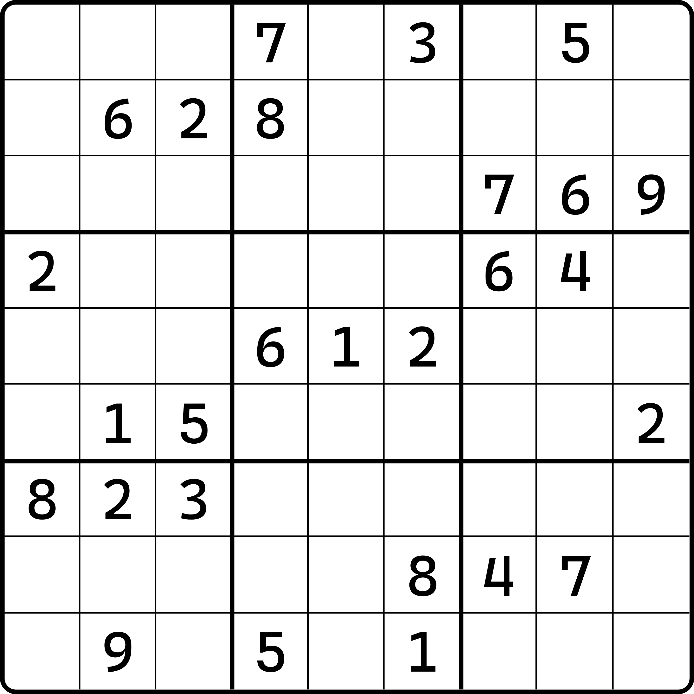
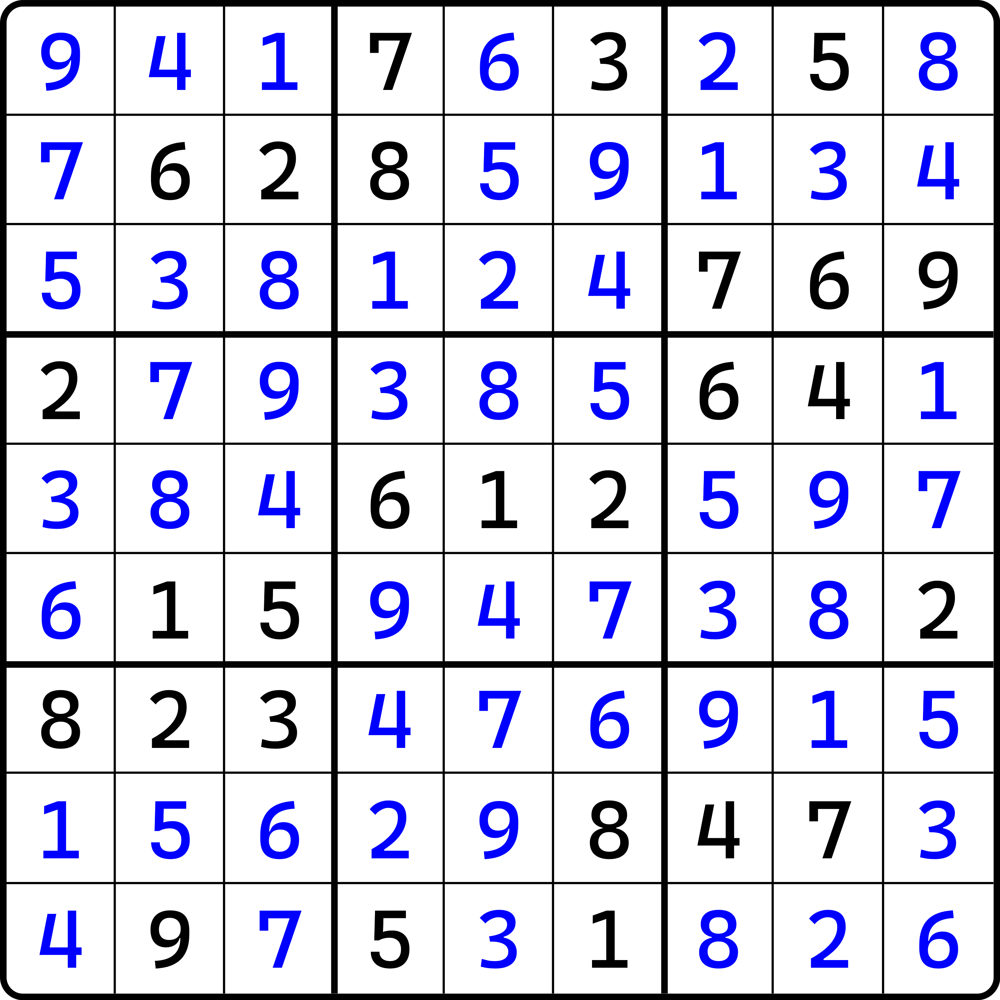

# 初来乍到

欢迎来到数独的世界！从今天开始，我们的数独教程就正式开始更新。

因为我平时没有空闲的时间，因此没有时间做视频。于是还是开始我的老本行，写专栏文章。

不过这次，我打算把事情改造得更加不一样一点。我打算把它移动到可修改的云端。网址是 [t.sudoku-studio.wiki](https://t.sudoku-studio.wiki)。

## 数独是什么

数独是一个益智游戏，准确来说是填数类游戏。它仅要求玩家往单元格里填入数字 1-9 即可。如图所示：

<figure><figcaption>
一个例子
</figcaption></figure>

这便是一个数独题目。它在盘面里有一些元素：如粗线、细线、单元格，以及数字。你需要在空格里填入和题目一样的数字（每一个格子只填一个数）。

其规则是这样的：在空格里填入 1-9，使得每一横排，每一竖列，以及每一个由图中粗线围起来的 3×3 的九宫格里，这样的 9 个格子里填数必须为 1-9 出现各一次。

也就是说，比如左上角的空格，因为横行里出现了 3、5、7，因此你不能往空格里填 3、5、7，因为这样填违背了规则要求。同理，竖列里有 2 和 8，因此同样空格里不能填入 2 和 8。怎么样，这个规则够简单吧。

## 解的定义

像是这样的题，我们的目的是什么？我们需要完成整个题面（我们称之为**盘面（Grid）**）。

我们完成的题目，也就是整个盘面，都需要有可解的答案。换言之，每一个空格需要对应一个合适的填数结果。

我们把题目的一个满足数独规则的填数答案称为题目的一个**解（Solution）**。任何一个题目都可以有一个解，可以有多个解，也可以没有解，但我们规定，一个合适的、可提供玩家游玩的题目，必须是唯一解的。这是一个题目作为合格数独题的最基本要求。

比如前面这个题目，它的解长这样：

<figure><figcaption>
前文题目的解
</figcaption></figure>

可以看到，数独这种要求如此简单，但也如此严格的规则，也能有满足条件的填法。
